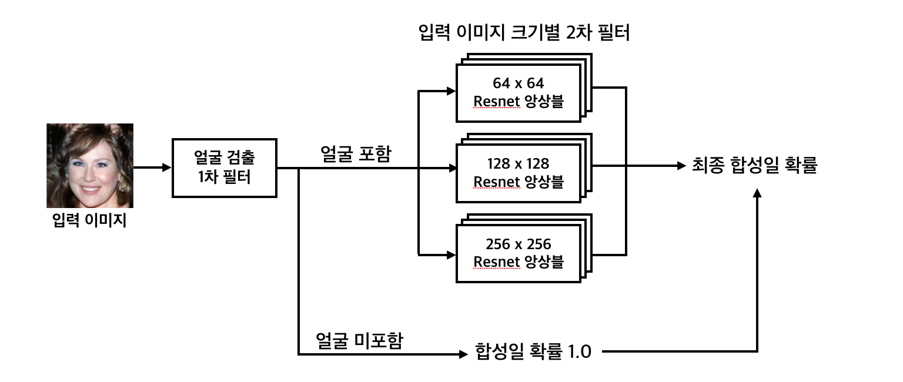
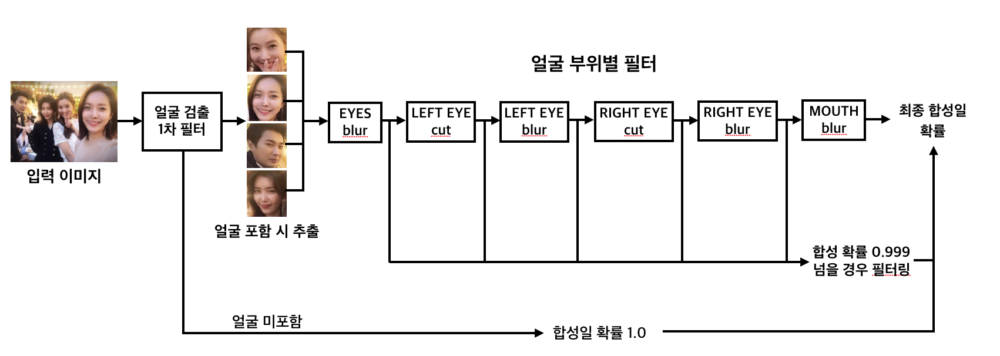

# Fake_image

2018 Fake image challenge를 위한 code들입니다.

김형준, 김유리, 김해중, 신웅비, 양유준, 이동호, 이정훈, 정수민, 이다솜 supervised by 기계인간

프로젝트 소개
----------

2018 Fake image challenge에서 제시된 두 가지 임무에 대하여 CNN을 활용한 합성 이미지 탐지 모델을 구축했습니다.
  
* 임무 1 : 인공지능이 생성한 이미지 탐지
  
* 임무 2 : 얼굴 전체, 혹은 일부가 합성된 이미지 탐지
  
본 프로젝트는 챌린지에서 본선 진출 47팀 가운데 최종 (현재 미정) 위를 기록했습니다.

* 임무 1 AUROC : (현재 미정)
  
* 임무 2 AUROC : (현재 미정)

합성 이미지 탐지 모델 구조
--------------------

### 임무 1

</img>

### 임무 2

</img>

환경 설정
-------
OS : Ubuntu 16.04 LTS

Python : 3.6.4

GPU library : CUDA 9.0

Additional library : pip install -r requirements.txt 명령어를 통해 설치하면 된다.

Crawler 사용법
------------
Fake_image/crawler/ 경로에서 다음과 같은 명령어를 실행

(Flickr는 API KEY를 기재해주어야 실행이 되어 같은 폴더안에 넣어 놓지 않음)

Google : scrapy crawl google -a keyword=노바 -a dirname=nova

Naver : scrapy crawl naver -a keyword=노바 -a dirname=nova

Tumblr : scrapy crawl tumblr -a keyword=노바 -a dirname=nova

Insta : scrapy crawl insta -a keyword=노바 -a dirname=nova

keyword와 dirname 다른 이유 : 파일 경로에 한글이 사용될 수 없으므로 한글 keyword의 경우 영어로 바꾸어 dirname에 기재해야 한다.
